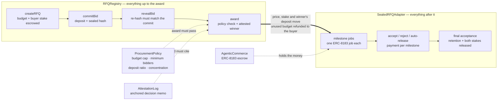

# SealedRFQ on Arc

Sealed-bid B2B procurement on [Arc](https://docs.arc.io): suppliers commit sealed bids with a USDC
deposit, an AI evaluator scores them against a rubric published before bidding opened, an on-chain
procurement policy enforces the award, and the winner is paid milestone by milestone through
ERC-8183 escrow.

> Work in progress for the Arc Microgrants program. Plan: [`workplan.md`](workplan.md).
> Design: [`docs/architecture.md`](docs/architecture.md) · Stack: [`docs/techstack.md`](docs/techstack.md).

## Layout

```
contracts/          Foundry project (Solidity 0.8.28, OpenZeppelin 5.7)
packages/shared/    USDC 6-decimal helpers, Arc chain config, decision-memo schema + hashing
```

## Run it locally (no testnet funds)

`arc-anvil` gives a throwaway chain with Arc's rules, the USDC precompile and prefunded accounts, so
the whole stack runs offline — and its clock can be pushed forward instead of waiting out bidding,
reveal and acceptance windows.

```bash
pnpm local            # chain + contracts + seeded RFQs + agent + web on localhost:3000
pnpm local:demo       # the full lifecycle end to end in ~90s, warping past every window
pnpm local:warp 5m    # skip a window while clicking through the UI yourself
pnpm local:status
pnpm local:down
```

`pnpm local` prints the MetaMask settings (chain 31337) and the account keys to import. Each starts
with 1,000,000 USDC. The seeded RFQs deliberately sit in different phases — one sealed, one in
reveal as an RFP, one price-only — and supplier 3 never reveals anywhere, so deposit forfeiture is
visible too.

> Account #9 is skipped throughout: it is the USDC proxy admin on a local Arc chain, and the proxy
> refuses calls from its own admin.

## Develop

```bash
pnpm install
git submodule update --init --recursive

pnpm test                    # TypeScript packages
cd contracts && forge test   # unit tests (MockUSDC) + read-only Arc forks

# Arc rules (system precompiles, blocklist): Arc Foundry v0.8.0-1, installed as arc-forge.
# https://github.com/circlefin/arc-foundry/releases (aarch64-apple-darwin / linux builds)
cd contracts && FOUNDRY_PROFILE=arc ARC_TESTNET_RPC_URL=https://rpc.testnet.arc.io arc-forge test
```

Keys live in `.env.testnet` / `.env.mainnet` (gitignored); see `.env.example`.

## Live on Arc testnet (chain 5042002)

| Contract | Address |
|---|---|
| `RFQRegistry` | [`0xb727F5A8031591bc7e1ed0E626f5cE1108626D61`](https://explorer.testnet.arc.io/address/0xb727F5A8031591bc7e1ed0E626f5cE1108626D61) |
| `SealedRFQAdapter` | [`0xC72B8a49020a9B9dACb384b88CDB9580770fA9C0`](https://explorer.testnet.arc.io/address/0xC72B8a49020a9B9dACb384b88CDB9580770fA9C0) |
| `AgenticCommerce` (ERC-8183) | [`0xe98D25AB2ED549E699B8ECf40e03817bfA83e36b`](https://explorer.testnet.arc.io/address/0xe98D25AB2ED549E699B8ECf40e03817bfA83e36b) |
| `ProcurementPolicy` | [`0xC3B99CaEa00A4f8918DDf44Be4DB257853B101F0`](https://explorer.testnet.arc.io/address/0xC3B99CaEa00A4f8918DDf44Be4DB257853B101F0) |
| `AttestationLog` | [`0xF79126bdBE73d023Fd6FA57fB05E746a839a6096`](https://explorer.testnet.arc.io/address/0xF79126bdBE73d023Fd6FA57fB05E746a839a6096) |

`contracts/deployments/evidence-5042002.json` lists one explorer link per lifecycle step of the last
full run, including the policy firewall rejecting an AI-recommended over-budget award.

Run it yourself: `./script/demo.sh testnet`.

## How it works

Five contracts. `RFQRegistry` owns everything up to the award; `SealedRFQAdapter` owns everything
after it, on top of an ERC-8183 escrow (`AgenticCommerce`). `ProcurementPolicy` holds the caps and
`AttestationLog` holds the anchored AI decisions.



1. **Create.** Budget and buyer stake are pulled into escrow in the same transaction that opens the
   RFQ, so a supplier never bids against an unfunded one.
2. **Commit.** A bid is `keccak256(contract, chainId, rfqId, bidder, price, deliveryDays,
   proposalHash, salt)` plus a USDC deposit. The bidder's address is *inside* the hash, so copying
   someone else's commitment is useless — they could never reveal it.
3. **Reveal.** The contract re-hashes the claimed values and compares. A bid that is never revealed
   forfeits its deposit; that forfeiture is what makes a sealed bid binding rather than an option.
4. **Award.** Checked against `ProcurementPolicy` (budget cap, minimum bidders, deposit ratio,
   rubric match, concentration) *and* against an evaluator's recommendation anchored for that exact
   winner. The price, the buyer stake and the winner's deposit move to the adapter; unused budget
   returns to the buyer; the winner's deposit becomes a performance stake.
5. **Milestones.** One ERC-8183 job per milestone. The supplier submits a deliverable hash, the
   buyer accepts or rejects with a reason, and retention accrues until final acceptance releases it
   along with both stakes.

### How it tells a buyer from a supplier

There is no registration and no account type. Identity is **positional** — it is whatever you did,
recorded when you did it:

| | Becomes | Stored as |
|---|---|---|
| Whoever calls `createRFQ` | the buyer | `rfq.buyer = msg.sender`, with their money escrowed in the same call |
| Whoever calls `commitBid` | a supplier | `_bids[rfqId][msg.sender]`; the deposit is the only entry ticket |
| Whoever wins | the supplier of record | `engagement.supplier`, fixed at award |

Every later check compares `msg.sender` against those stored addresses (`NotBuyer`, `NotSupplier`).
Nothing is granted, so roles are per RFQ, not per account: the same wallet can be a buyer on one and
a supplier on another. A buyer cannot bid on their own RFQ (`BuyerCannotBid`).

Granted roles exist only for the **agent keys**, through OpenZeppelin `AccessControl`, and they are
deliberately narrow: `EVALUATOR` scores and anchors but cannot award, `AWARDER` awards but only the
bidder an evaluator already recommended, `VERIFIER` signs off milestones but can never refund a
deposit, `ARBITER` can only split escrow that is already in dispute.

| Action | Who |
|---|---|
| `createRFQ` | anyone — becomes the buyer |
| `commitBid`, `revealBid` | anyone — becomes a supplier |
| `cancelRFQ`, `addInvitees` | that RFQ's buyer |
| `award` | the buyer **or** `AWARDER`, both bound by policy and the attested recommendation |
| `submit` | the winning supplier (ERC-8183 checks `job.provider`) |
| `acceptMilestone`, `rejectMilestone` | the buyer **or** an attested `VERIFIER` |
| `raiseDispute` | the supplier |
| `resolveDispute` | `ARBITER` |
| `settleDeposit`, `closeNoAward`, `autoRelease`, `settleExpired`, `withdraw` | **anyone** |

### Why that last row is permissionless

Those functions decide nothing; they enforce a clock that has already run out. `autoRelease` pays
the supplier only if the buyer stayed silent past the acceptance window. `closeNoAward` refunds only
after the award window closed with no award. `settleDeposit` refunds a revealed loser or forfeits an
unrevealed bid. `withdraw` only ever pays `msg.sender` from their own credited balance.

If these required permission, either party could hold the other hostage by simply doing nothing.
Leaving them open means a stranger or a keeper bot can push the state forward and the outcome is
identical whoever calls — the caller cannot choose *what* happens, only *when* someone stops waiting.

## Deploying

Two services. The web app is a static-ish Next.js front end that talks to the chain from the user's
own wallet; the agent is a long-running process that indexes, scores and attests.

**Web → Vercel.** Set the project's Root Directory to `apps/web` and turn on "Include source files
outside of the Root Directory", because the build reaches up to the workspace for
`@sealedrfq/shared`. `apps/web/vercel.json` already carries the install and build commands. Three
variables, all public by design:

```
NEXT_PUBLIC_ARC_CHAIN_ID=5042002
NEXT_PUBLIC_ARC_RPC_URL=https://rpc.blockdaemon.testnet.arc.network
NEXT_PUBLIC_AGENT_URL=https://<your-agent>.up.railway.app
```

**Agent → Railway.** `railway.json` points at `apps/agent/Dockerfile`, which is built from the
repository root. Two things are easy to get wrong:

- **Mount a volume at `/data`.** The index lives in SQLite, and a container filesystem is discarded
  on every deploy — without a volume the agent re-indexes from the deployment's `startBlock` each
  time it restarts. `DATABASE_URL` already defaults to `file:/data/agent.db`.
- **Set `AGENT_API_TOKEN` and `CORS_ORIGIN`.** `NEXT_PUBLIC_AGENT_URL` is compiled into the browser
  bundle, so the agent is called directly from the user's browser and is public by construction.

```
ARC_CHAIN_ID=5042002
ARC_RPC_URL=https://rpc.blockdaemon.testnet.arc.network
CORS_ORIGIN=https://<your-app>.vercel.app
AGENT_API_TOKEN=<openssl rand -hex 32>
EVALUATOR_PK=…   AWARDER_PK=…   VERIFIER_PK=…   ARBITER_PK=…
X402_ENABLED=true  X402_PAY_TO=…  X402_PRICE=0.05
```

`POST /rfqs/:id/award` and `POST /reindex` are **disabled until `AGENT_API_TOKEN` is set**, rather
than open until it is. The first makes the service broadcast a transaction signed by the awarder
key; the second is a free way to exhaust the RPC budget. The on-chain policy still prevents an
award the evaluator never recommended, so neither is a route to the escrow — but choosing *when* a
buyer's award lands is not a stranger's choice to make.

The role keys are hot on the host. That is the honest cost of an agent that acts on its own, and it
is why the keys are split per role: a leaked evaluator key can score and attest but cannot award or
move escrow.

## Paying the agent: x402

Scoring an RFQ costs real inference, so `POST /rfqs/:id/evaluate` can be sold rather than given
away. It speaks [x402](https://x402.org) v2 — the HTTP 402 handshake for machine payments. An unpaid
call gets a 402 whose `PAYMENT-REQUIRED` header carries the terms; the caller signs a USDC
authorisation and retries. Circle runs a facilitator that settles Arc on both networks, so the fee
is USDC, paid to a USDC-settled service, on a chain where USDC is also the gas:

```
$ curl -X POST https://<agent>/rfqs/1/evaluate        # HTTP 402, body {}
PAYMENT-REQUIRED: { "x402Version": 2,
  "accepts": [{ "scheme": "exact", "network": "eip155:5042002",
                "asset": "0x3600000000000000000000000000000000000000",
                "amount": "50000", "payTo": "0x…" }] }
```

Circle's `exact` scheme signs against their `GatewayWalletBatched` contract rather than USDC's own
EIP-3009 domain, which is what makes a five-cent price practical: payments batch instead of
settling one transaction at a time. Settling each call on its own would cost more than the call.

**Only that one route is metered.** `GET /rfqs/:id/evaluation` and `GET /audit/:id` are free and
always will be. The argument this whole project makes is that a losing bidder can re-hash the memo
and check it against the chain without anyone's permission; charging for that would contradict it.
What is sold is *compute on demand* — the scheduler scores every RFQ on its own anyway.

Fees land in the seller's Gateway balance, not its wallet, and `withdraw` moves them out for a flat
fee of about 0.0035 USDC. At five cents a call that is 7% of one evaluation, so withdraw in batches
rather than per call — and note that a balance below the fee cannot be withdrawn at all.

Off unless `X402_ENABLED=true`. Enabled on a chain Circle cannot settle, or without a payout
address, the agent refuses to boot rather than quietly serving a paid endpoint for free. `GET /meta`
advertises the price, so a buying agent can budget the call without provoking a 402 to discover it.

## Which procurement instruments this covers

| | Covered | How |
|---|---|---|
| **RFQ** | yes | Sealed price + delivery bids on defined items, awarded against a published rubric |
| **RFP** | yes | `requiresProposal` RFQs seal a proposal document hash alongside the price, so the method cannot be revised after rival bids open. Milestone escrow with retention and acceptance windows is RFP machinery: nobody holds back 10% when buying laptops |
| **RFI** | no, by design | An RFI has no price, no award and no money at stake, so every guarantee here (funded-before-open, deposit forfeiture, the policy firewall) would have to be switched off to support it. Its on-chain analogue is supplier **qualification** — `requiresQualification` plus the ERC-8004 validation registry answers "who can do this?" |

Two-envelope evaluation (technical scores locked before prices open) is a roadmap item: today both
are revealed together and weighed by the published rubric.

## Sealed bids and lost secrets

A sealed bid hides its price behind `keccak256(registry, chain, rfq, bidder, price, days, salt)`.
Revealing needs that exact salt, and an unrevealed bid forfeits its deposit — that forfeiture is what
makes a commitment binding, so there is no contract-level "I lost it" refund: it would let a bidder
decline to reveal whenever the reveal looked unprofitable.

Recovery therefore lives in the client. The salt is derived from a wallet signature over a
bid-scoped message, so the same wallet regenerates it on any device; it is also cached locally and
downloaded as a reveal file. During bidding, a bidder can simply re-commit with a fresh secret,
which takes no second deposit.

## Arc rules this codebase follows

- Settlement is the USDC ERC-20 interface at `0x3600…0000` (6 decimals). Never `msg.value`.
- Payouts are pull-only (`withdraw()`), so a blocklisted recipient parks funds instead of bricking a flow.
- One confirmation is final; no confirmation counters. `block.prevrandao` is never used.
